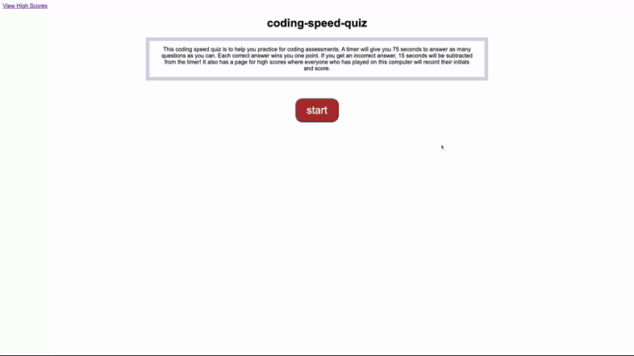

# coding-speed-quiz
This is a timed quiz game to prepare the user for coding assessments.

## Screencastify

## Screenshots

### Landing page

### Sample question (real game has 4 questions)

### Quiz completion screen with form for initials

### High score page

## Links

* [GitHub](https://github.com/queendoescode/coding-speed-quiz)

* [Deployed site](https://queendoescode.github.io/coding-speed-quiz/)

## Third Party Resources used by this site

None
